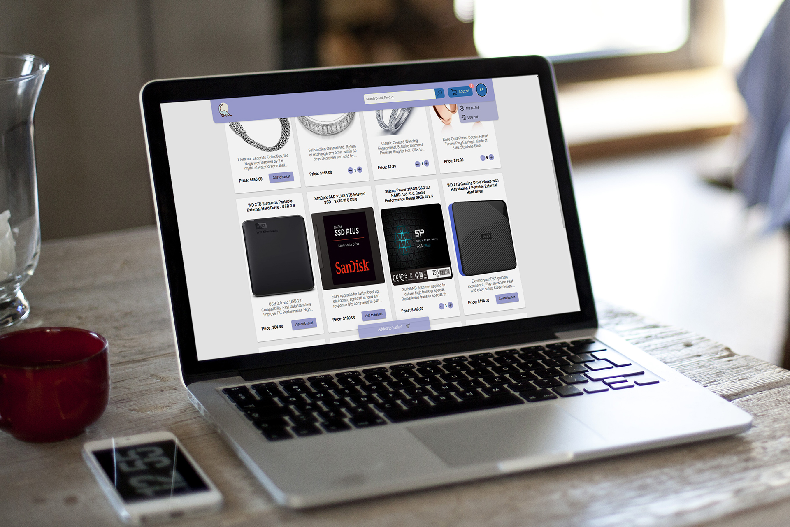
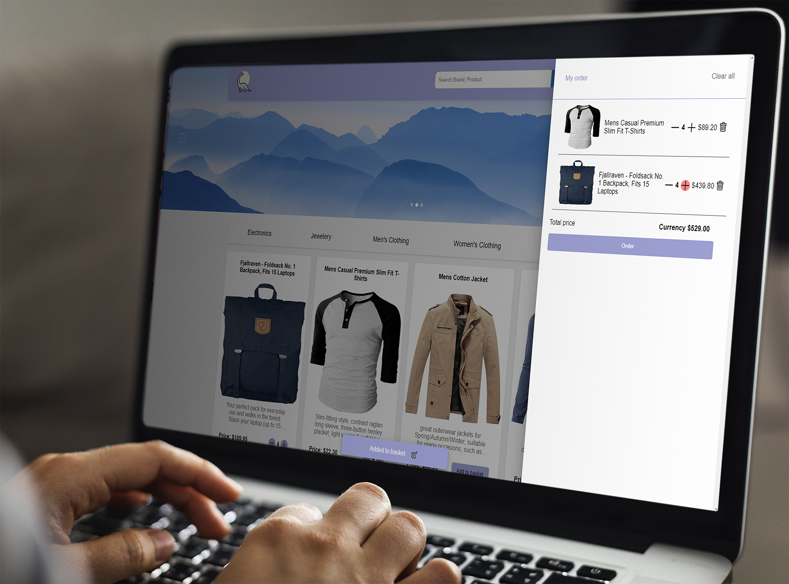

# 🦖 Codezilla

Welcome to Codezilla, a single-page frontend Online Shop web application powered by Angular 15.
This project demonstrates my expertise in client-side rendering and frontend development.

### Key Features:
- **Product List Page**: Browse through a vast collection of products from various categories.
- **Product Detail Page**: Get detailed information about each product with a stunning user interface.
- **Filters by Category**: Easily find products that match your preferences by filtering through categories.
- **Persistent Shopping Cart**: Your shopping cart stays intact even if you leave and come back later.
- **Cart & Order Management**: Efficiently manage your cart and orders with seamless user interactions.
- **Real-time Notifications**: Stay updated with notifications for order updates and statuses.
- **Secure Authentication**: Ensure the safety of user data with cookie authentication.
- **REST API Integration**: Interact with the backend using a well-structured REST API.
- **Order Management**: Keep track of your orders.
- **Engaging Slider**: Experience a dynamic and interactive user interface.
- **Standalone Components**: Benefit from reusable, modular, and maintainable code with custom standalone components, enhancing development efficiency.
- **Custom Pipes**: Easily manipulate and format data, ensuring a delightful user experience.
- **Unit Tests**: Comprehensive unit tests to ensure the stability and reliability of the application's components and services.
### Technology Stack:
- **Angular 15**
- **Angular CLI**
- **NGXS**
- **RxJs**
- **MaterialUI**
### Interface:
Product page

Cart

### How to Get Started:
1. Clone this repository to your local machine.
2. Install Node.js and Angular CLI if you haven't already.
3. Run **npm install** to install project dependencies.
4. Execute **ng serve** in your terminal to start the development server.

### Future Enhancements:
- JWT authentication
- Internationalization (i18n)
- Order history
- Advanced Search Functionality
- Responsive Design
- User Reviews & Ratings
- Global error interceptor
- Admin dashboard
- Payment page
- Pagination
- Location
- Profile page improve and photo add
- Discounts & promotions
- User onboarding
- Automated Testing

### Contact:
Thank you for considering Codezilla! If you have any questions or want to discuss potential job opportunities, feel free to reach out to me at **nitroxess@gmail.com**

